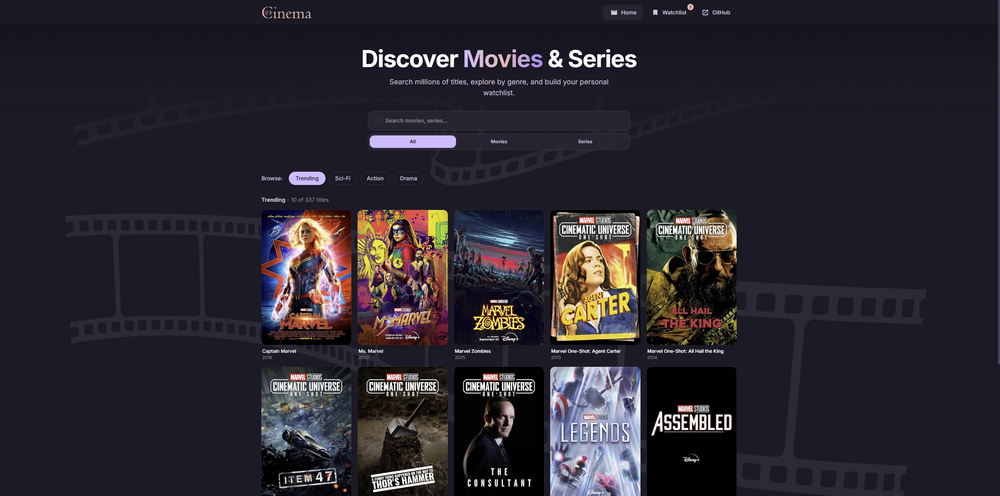
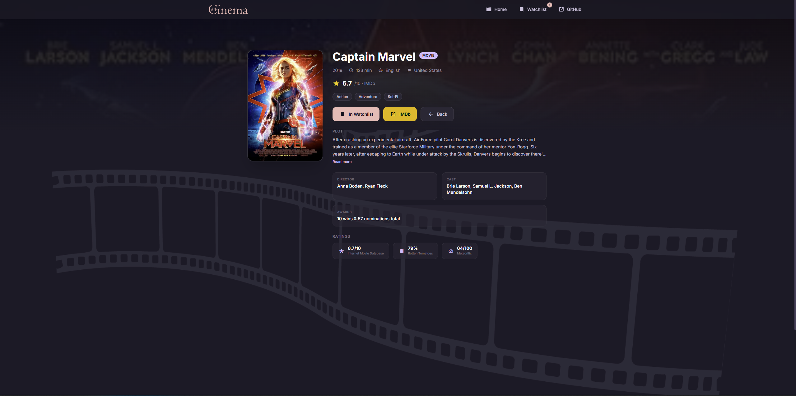
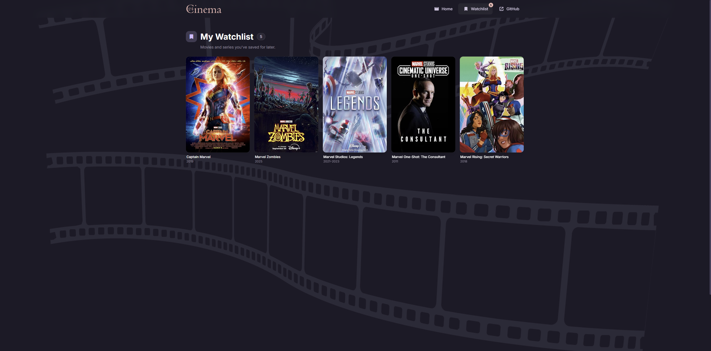

# Cinema24 🎬

> **v2.0.0** - Full UI/UX modernization, Watchlist, debounced search, type filtering, skeleton loaders, and more.

A professional Angular movie search application powered by the OMDB API. Discover, filter, and save your favourite movies and series with a cinematic dark UI built on Angular 16, Angular Material, and Tailwind CSS.

## ✨ What's New in v2.0.0

- **Watchlist** - Save movies/series to a persistent local watchlist (localStorage), accessible from any page
- **Debounced search** - `debounceTime` + `distinctUntilChanged` + `switchMap` pipeline eliminates redundant API calls
- **Type filter** - Filter results by All / Movies / Series directly from the search bar
- **Category browsing** - Browse curated categories (Trending, Sci-Fi, Action, Drama) without typing
- **Skeleton loaders** - Animated placeholder cards while results load
- **Hero section** - Full cinematic homepage hero with gradient headline
- **Movie detail overhaul** - Blurred backdrop hero, glassmorphism detail card, plot expand, all ratings sources (IMDb, Rotten Tomatoes, Metacritic), genre pills, runtime/language/country meta
- **Responsive header** - Glassmorphism navbar with active route highlighting, watchlist badge counter, and mobile hamburger drawer
- **Enhanced footer** - Two-column layout with navigation and external links
- **Route animations** - Smooth fade+slide transitions between pages
- **Poster fallback** - Graceful placeholder when OMDB returns no image
- **Custom scrollbar** - Thin brand-colored scrollbar
- **Inter font** - Upgraded typography with Inter alongside Roboto
- **Bug fixes** - Fixed `imbdID` typo in Movie model, fixed `searchExecuted` not resetting on clear, fixed subscription leaks with `takeUntil` + `OnDestroy` across all components
- **scroll restoration** - Pages scroll to top on navigation
- **Load More / Pagination** - Fetch additional pages of results beyond the initial 10, appending them to the grid with inline skeleton loaders

## ✨ Features

- **Smart Search** - Debounced live search with type filter (All / Movies / Series)
- **Category Tabs** - Browse trending, sci-fi, action, and drama without searching
- **Movie Details** - Full plot, cast, director, awards, genre pills, all rating sources, runtime, language
- **Watchlist** - Add/remove titles with a bookmark toggle; persisted in `localStorage`
- **Skeleton Loaders** - Polished loading states on every data fetch
- **Responsive** - Mobile-first layout, works on all screen sizes
- **404 Page** - Glitch-effect animated error page with navigation back
- **IMDB Integration** - Direct links to IMDb title pages
- **Load More** - Paginated results with "X of Y" counter; fetch as many pages as you like

## 📸 Screenshots







## 🛠️ Tech Stack

- **Frontend**: Angular 16
- **UI Framework**: Angular Material 16
- **Styling**: Tailwind CSS 3 + custom brand tokens
- **Typography**: Inter, Roboto
- **API**: OMDB API
- **State**: RxJS (`BehaviorSubject`, `switchMap`, `debounceTime`)
- **Persistence**: `localStorage` via `WatchlistService`
- **Testing**: Jasmine & Karma
- **Build Tool**: Angular CLI 16

## 🏁 Getting Started

### Prerequisites

- Node.js (v16 or higher)
- npm
- Angular CLI (`npm i -g @angular/cli`)

### Installation

1. Clone the repository

```bash
git clone https://github.com/klajdm/Cinema24.git
cd Cinema24
```

2. Install dependencies

```bash
npm install
```

3. Set up environment variables

```bash
# Update src/environments/environment.prod.ts with your OMDB API key
# Get a free key at https://www.omdbapi.com/apikey.aspx
```

4. Start the development server

```bash
ng serve
```

5. Open your browser at `http://localhost:4200`

## 📦 Build

```bash
# Production build
ng build --configuration production

# Development build with watch
npm run watch
```

## 🧪 Testing

```bash
# Run unit tests
ng test

# Run with coverage
ng test --code-coverage
```

## 📁 Project Structure

```
src/
├── app/
│   ├── models/
│   │   └── movie.model.ts        # Movie interface (all fields)
│   ├── pages/
│   │   ├── home/                 # Hero, debounced search, category tabs, grid
│   │   ├── movie/                # Detail page with backdrop hero
│   │   ├── watchlist/            # Saved titles page
│   │   └── error404/             # Glitch-effect 404
│   ├── services/
│   │   ├── movie.service.ts      # OMDB API (search + detail)
│   │   └── watchlist.service.ts  # localStorage watchlist
│   ├── shared/
│   │   └── layout/
│   │       ├── header/           # Glassmorphism nav + mobile menu
│   │       └── footer/           # Two-column footer
│   ├── app-routing.module.ts
│   ├── app.module.ts
│   └── app.component.ts          # Route animations
├── assets/
├── environments/
└── styles.css                    # Global styles, scrollbar, focus rings
```

## 🤝 Contributing

1. Fork the project
2. Create your feature branch (`git checkout -b feature/AmazingFeature`)
3. Commit your changes (`git commit -m 'Add some AmazingFeature'`)
4. Push to the branch (`git push origin feature/AmazingFeature`)
5. Open a Pull Request

## 📄 License

This project is licensed under the MIT License - see the [LICENSE](LICENSE) file for details.

## 👨‍💻 Author

**Klajdi Murataj**

- GitHub: [@klajdm](https://github.com/klajdm)
- Portfolio: [klajdimurataj.dev](https://klajdimurataj.dev/)

## 🙏 Acknowledgments

- [OMDB API](http://www.omdbapi.com/) for providing movie data
- [Angular](https://angular.io/) for the framework
- [Angular Material](https://material.angular.io/) for UI components
- [Tailwind CSS](https://tailwindcss.com/) for utility-first styling
- [Inter](https://rsms.me/inter/) for the typeface

---

If you like this project, please consider giving it a ⭐ on GitHub!
